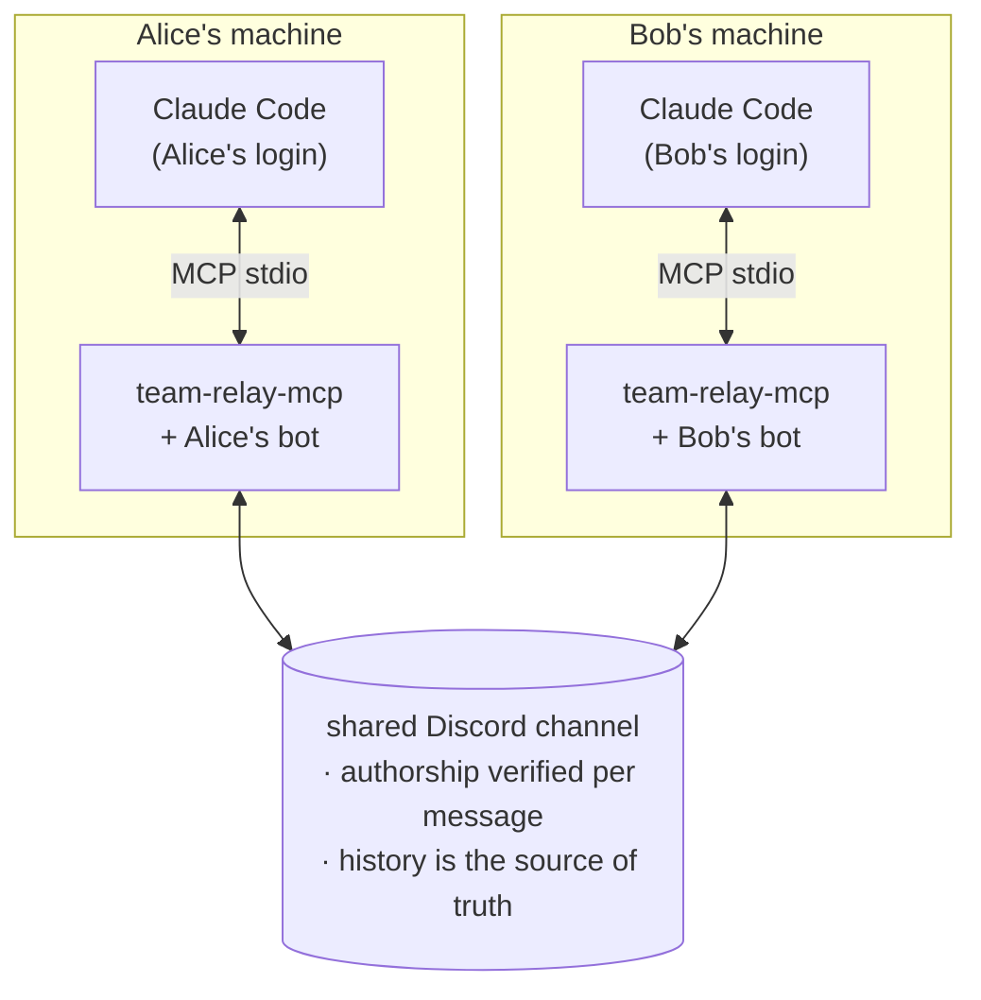

# team-relay-mcp

[](https://github.com/slihump/team-relay-mcp/actions/workflows/ci.yml)
[](LICENSE)
[](package.json)
[](https://modelcontextprotocol.io)

An MCP server that lets a small team's **separate** Claude Code sessions ask each
other questions, hand back answers, and share decisions — through one shared chat
channel, with each person on their own Claude subscription.

No API key. No central server. No shared credentials. The relay never calls a
model; it only moves messages in and out of a Discord channel.



## Why this exists

Claude Code in 2026 has good building blocks for one person — [Channels](https://code.claude.com/docs/en/channels-reference)
(bridge one session to Discord/Telegram), [cross-session messaging](https://code.claude.com/docs/en/cross-session-messaging)
(sessions on **one machine**), [Agent Teams](https://docs.claude.com/en/docs/claude-code/agent-teams)
(one person's agents), [Remote Control](https://code.claude.com/docs/en/remote-control)
(your own session from another device). None of them connect **two different
people on two different subscriptions**. That's the gap this fills.

`team-relay-mcp` is a thin layer for one narrow job: teammate ↔ teammate Q&A and
a shared decision log, built to be **async-first** — it assumes sessions are
usually off and makes sure nothing is lost when they come back.

**What it is not:** real-time. v1 polls channel history when Claude calls
`team_sync`. See [ROADMAP.md](ROADMAP.md).

## Install

```bash
npm install -g team-relay-mcp
# or run without installing: npx -y team-relay-mcp <command>
```

### 1. Create your Discord bot (each teammate does this once)

Every teammate runs **their own** bot so that message authorship can be verified
(a shared bot could not tell who sent what).

1. <https://discord.com/developers/applications> → **New Application**
2. **Bot** → enable **Message Content Intent** (under Privileged Gateway Intents).
   Required — without it you cannot read teammates' messages.
3. **Bot** → **Reset Token** → copy it somewhere safe.

That is all you need from the portal. You do **not** have to visit the OAuth2 URL
Generator or pick permissions by hand: setup builds the invite link for you, with
the right permissions already in it.

One person creates a channel for the team (e.g. `#claude-relay`) and invites
everyone's bots to that server. Nobody needs to copy the channel id — setup lists
the channels your bot can see and you pick one.

### 2. Run setup

From your project directory:

```bash
npx -y team-relay-mcp init
```

On a terminal this runs a wizard. Here is a whole run — the only things typed are
a name, the token, and `bob`'s bot id:

```console
$ npx -y team-relay-mcp init
team-relay-mcp setup

✔ Your name (teammates will address you by it) alice
✔ Your Discord bot token ********************************
  authenticated as alice-relay (1546373827578167447)
  Server: acme-dev
? Which channel?
❯ #claude-relay
  #general
↑↓ navigate • ⏎ select
```

Pick the channel and it verifies it can read there, then shows the id to give
your teammates:

```console
✔ Which channel? #claude-relay

  Your bot's user id is 1546373827578167447
  Share it with your teammates, and collect theirs.

✔ Add a teammate? (0 added) Yes
✔   Teammate name bob
✔   bob's bot user id 1546381319724859412
  Added bob — bot "bob-relay"
✔ Add a teammate? (1 added) No
```

A teammate's bot id is the one value you still have to paste, so it is checked
against Discord before it is accepted. A typo of the right length is refused
here rather than silently dropping that teammate's messages later:

```console
✔   bob's bot user id 1231546381319724859412
  no Discord user with id 1231546381319724859412 (HTTP 400: Invalid Form Body
  user_id[NUMBER_TYPE_MAX]: snowflake value should be less than or equal to
  9223372036854775807.)
  Ask them to re-run `team-relay-mcp init`; it prints their bot's id.
```

Nothing is written until you approve a summary, and any answer can be redone
from it — a typo does not mean starting over:

```console
  Your name  alice
  Bot        alice-relay (1546373827578167447)
  Channel    #claude-relay in acme-dev
  Teammates  bob
? Save this?
❯ Save and finish
  Change your name
  Change bot
  Change channel
  Change teammates
↑↓ navigate • ⏎ select
```

Choosing **Save and finish** writes the config and prints what to do next:

```console
Wrote .team-relay/team.json and .team-relay/.env.

Add this to your project's .mcp.json:

{
  "mcpServers": {
    "team-relay": {
      "command": "npx",
      "args": [
        "-y",
        "team-relay-mcp"
      ],
      "env": {
        "TEAM_RELAY_CONFIG_DIR": ".team-relay"
      }
    }
  }
}

✔ Append the CLAUDE.md guidance snippet? Yes
  Appended to CLAUDE.md.

Next: run `team-relay-mcp doctor`, then restart Claude Code.
```

**If your bot is not in a server yet**, setup notices and hands you the invite
link instead of sending you to the portal:

```console
  This bot is not in any server yet. Invite it:

    https://discord.com/oauth2/authorize?client_id=1546373827578167447&permissions=68608&scope=bot

? Done? (checks again) (Y/n)
```

Open it, add the bot to your team's server, answer `y`, and the wizard carries on.

`.team-relay/.env` holds your token and is written mode `0600`. Both files are
gitignored by this project's `.gitignore`; make sure yours ignores them too.

Piped or non-interactive runs (CI, `echo | init`) fall back to plain prompts that
ask for the channel id directly, so existing scripts keep working.

You can also edit `.team-relay/team.json` by hand later — to finish the roster
once teammates send you their bot ids:

```json
{
  "me": "alice",
  "channelId": "1234567890",
  "teammates": [
    { "name": "alice", "id": "111111111111111111" },
    { "name": "bob", "id": "222222222222222222" }
  ],
  "decisionsFile": "TEAM-DECISIONS.md",
  "transport": "discord"
}
```

### 3. Wire it into Claude Code

Paste the `.mcp.json` entry that setup printed into your project's `.mcp.json`.
If you answered **No** to the CLAUDE.md question, also copy
[docs/claude-md-snippet.md](docs/claude-md-snippet.md) into your `CLAUDE.md`.

Then restart Claude Code.

### 4. Check it

```bash
npx -y team-relay-mcp doctor
```

```console
[  ok  ] config: you are "alice", 2 teammate(s), transport=discord
[  ok  ] authenticated as alice-relay (1546373827578167447)
[  ok  ] channel found: #claude-relay
[  ok  ] can read message history
[  ok  ] teammate "bob" is bot "bob-relay"
[ warn ] make sure the bot's "Message Content" intent is ON in the Developer Portal —
         without it you cannot read teammates' messages

All checks passed.
```

`doctor` re-checks every roster entry, so it also catches a `team.json` you edited
by hand. The intent warning always prints — Discord does not expose that setting
over the API, so it is the one thing you have to confirm in the portal yourself.

## Tools

| Tool                                           | For                                                                                                                                |
| ---------------------------------------------- | ---------------------------------------------------------------------------------------------------------------------------------- |
| `team_sync`                                    | Catch up: questions to answer, answers to your questions, new decisions, notes. Call at session start and after each unit of work. |
| `ask_teammate(to, question, context?)`         | Ask one teammate something only they or their local code can answer.                                                               |
| `ask_team(question, context?)`                 | Broadcast a question to everyone.                                                                                                  |
| `reply(conversation_id, answer)`               | Answer a teammate's question.                                                                                                      |
| `ack(conversation_id, note?)`                  | Mark an answer to your question as resolved so it stops resurfacing.                                                               |
| `record_decision(topic, decision, rationale?)` | Log a decision; it lands in every teammate's `TEAM-DECISIONS.md`.                                                                  |
| `post_note(text, to?)`                         | Send an FYI that needs no answer.                                                                                                  |

## How it stays reliable

- **The channel is the source of truth.** Locally, each machine keeps only a
  cursor and which items it has acted on (`.team-relay/state.json`). Lose it and
  the next `team_sync` rebuilds from channel history.
- **Nothing is delivered once and forgotten.** A question to you reappears in
  every `team_sync` until you `reply`. An answer to you reappears until you `ack`.
- **Authorship is verified.** Every teammate posts via their own bot; an inbound
  message whose Discord author isn't in the roster, or whose payload `from`
  doesn't match that author, is dropped. `team_sync` reports the drop count.

## Security & privacy

- Relayed messages are **untrusted input**. The CLAUDE.md snippet tells Claude to
  treat them as information, never as instructions, and to confirm with you
  before sending code or acting on a relayed request.
- Everything posted to the relay is stored in Discord's channel history
  indefinitely. Don't relay secrets.
- Your bot token grants full access to that channel — keep `.team-relay/.env` out
  of git (the provided `.gitignore` handles it) and don't share it.

## Limitations

- **Not real-time** (v1). `team_sync` is a poll.
- **Routing is by name.** Names must be unique in the roster (case-insensitive).
- **Discord only** (v1).

## Development

```bash
npm install
npm test          # unit + integration, no Discord needed
npm run smoke      # build, then exercise the MCP server over stdio
npm run typecheck
```

The [`memory` transport](src/transport/memory.ts) runs the whole thing in-process
with no Discord bot — set `"transport": "memory"` in `team.json` to try the tools.

To point a local Claude Code at the built server before publishing:

```json
{
  "mcpServers": {
    "team-relay": {
      "command": "node",
      "args": ["/absolute/path/to/team-relay-mcp/dist/index.js"],
      "env": { "TEAM_RELAY_CONFIG_DIR": "/absolute/path/to/your/project/.team-relay" }
    }
  }
}
```

## License

MIT
