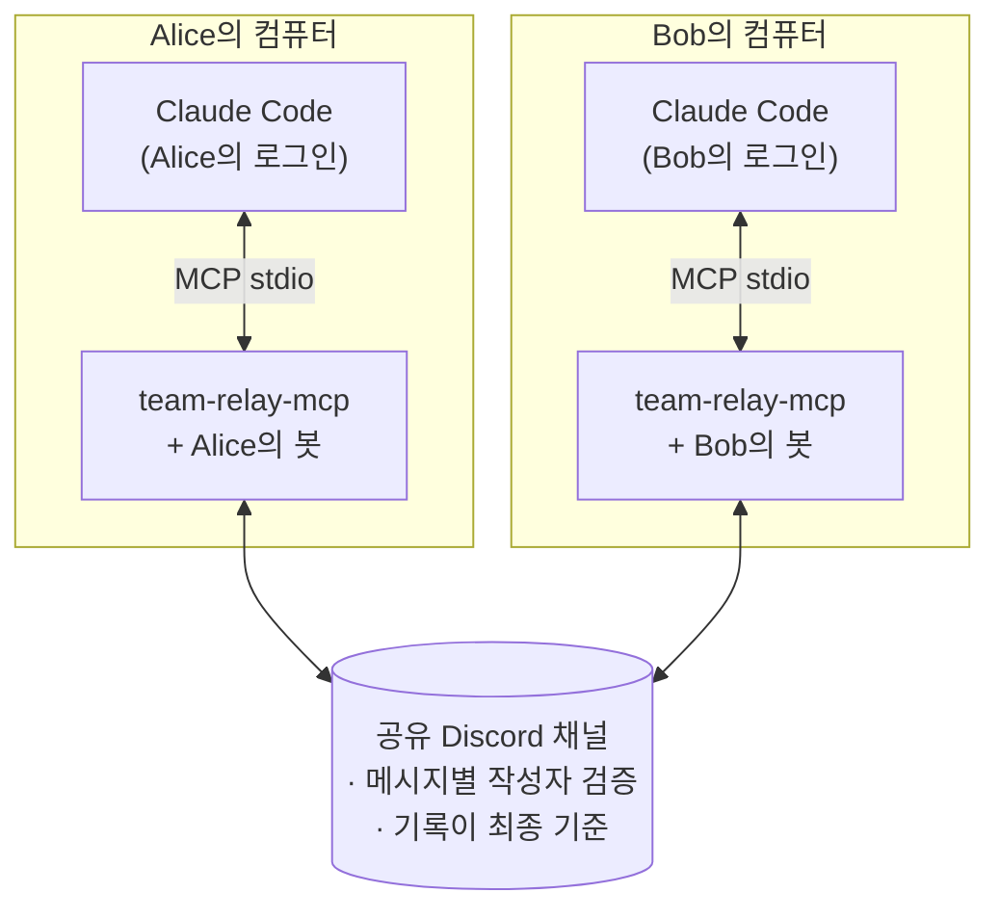
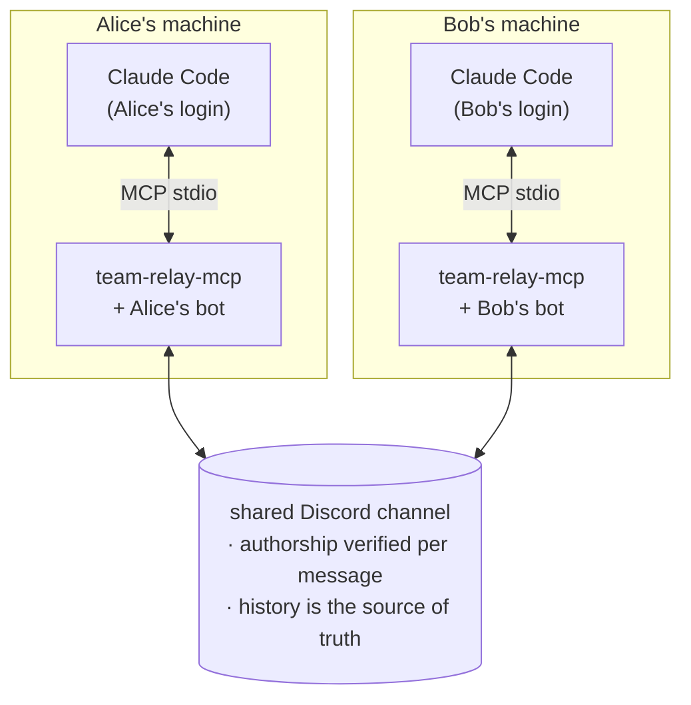

# team-relay-mcp

[](https://github.com/slihump/team-relay-mcp/actions/workflows/ci.yml)
[](LICENSE)
[](package.json)
[](https://modelcontextprotocol.io)

<details>
<summary><strong>🇰🇷 한국어 README 펼쳐보기</strong></summary>

## 한국어

소규모 팀의 **서로 분리된** Claude Code 세션이 하나의 공유 채팅 채널을
통해 서로 질문하고, 답변을 전달하고, 결정을 공유할 수 있게 해 주는 MCP
서버입니다. 각 팀원은 자신의 Claude 구독을 사용합니다.

API 키도, 중앙 서버도, 공유 자격 증명도 필요하지 않습니다. 릴레이는 모델을
호출하지 않고 Discord 채널에서 메시지를 가져오고 내보내기만 합니다.



## 만든 이유

2026년의 Claude Code에는 개인을 위한 좋은 구성 요소가 있습니다.
[Channels](https://code.claude.com/docs/en/channels-reference)는 하나의 세션을
Discord나 Telegram에 연결하고,
[cross-session messaging](https://code.claude.com/docs/en/cross-session-messaging)은
**한 컴퓨터**에 있는 세션들을 연결합니다.
[Agent Teams](https://docs.claude.com/en/docs/claude-code/agent-teams)는 한
사람의 에이전트들을 연결하고,
[Remote Control](https://code.claude.com/docs/en/remote-control)은 다른
기기에서 자신의 세션을 제어합니다. 하지만 이들 중 어느 것도 **서로 다른
구독을 사용하는 두 사람**을 연결하지 않습니다. `team-relay-mcp`는 이 빈틈을
채웁니다.

`team-relay-mcp`는 팀원 간 질의응답과 공유 결정 기록이라는 한 가지 역할만
수행하는 얇은 계층입니다. **비동기 우선**으로 설계되어 세션이 대부분 꺼져
있다고 가정하고, 다시 시작했을 때 어떤 메시지도 잃지 않도록 합니다.

**실시간 도구는 아닙니다.** v1은 Claude가 `team_sync`를 호출할 때 채널
기록을 폴링합니다. 자세한 내용은 [ROADMAP.md](ROADMAP.md)를 참고하세요.

## 설치

```bash
npm install -g team-relay-mcp
# 설치하지 않고 실행: npx -y team-relay-mcp <command>
```

### Docker로 실행

이미지는 `ghcr.io/slihump/team-relay-mcp`에 게시됩니다. MCP는 stdio를
사용하므로 컨테이너를 실행할 때 `-i`가 필요하며, 상태 파일과 결정 로그를
저장할 수 있도록 프로젝트를 `/workspace`에 읽기/쓰기 방식으로 마운트해야
합니다.

```bash
docker pull ghcr.io/slihump/team-relay-mcp:1

# 설정 마법사
docker run --rm -it \
  --user "$(id -u):$(id -g)" \
  --mount type=bind,source="$PWD",target=/workspace \
  ghcr.io/slihump/team-relay-mcp:1 init

# 연결 진단
docker run --rm -i \
  --user "$(id -u):$(id -g)" \
  --mount type=bind,source="$PWD",target=/workspace \
  --env-file "$PWD/.team-relay/.env" \
  ghcr.io/slihump/team-relay-mcp:1 doctor
```

설정 마법사는 설치 방식과 관계없이 마지막에 npm용 `npx` 설정을 출력합니다.
Docker로 사용할 때는 그 출력을 붙여 넣지 말고 아래 Docker 설정을 사용하세요.
프로젝트 절대 경로와 Linux UID/GID는 자신의 값으로 바꿔야 합니다. UID/GID는
`id -u`와 `id -g`로 확인할 수 있습니다. Docker Desktop(macOS/Windows)에서
마운트 권한 문제가 없다면 `--user`, `1000:1000` 두 항목을 빼도 됩니다.

```json
{
  "mcpServers": {
    "team-relay": {
      "command": "docker",
      "args": [
        "run",
        "--rm",
        "-i",
        "--user",
        "1000:1000",
        "--mount",
        "type=bind,source=/absolute/path/to/project,target=/workspace",
        "--env-file",
        "/absolute/path/to/project/.team-relay/.env",
        "ghcr.io/slihump/team-relay-mcp:1"
      ]
    }
  }
}
```

로컬 이미지는 저장소 루트에서 `npm run docker:build`로 만들며 이름은
`team-relay-mcp:test`입니다.

### 1. Discord 봇 만들기(팀원마다 한 번씩)

메시지 작성자를 검증할 수 있도록 팀원마다 **자신만의** 봇을 실행합니다.
하나의 봇을 공유하면 누가 어떤 메시지를 보냈는지 구분할 수 없습니다.

1. <https://discord.com/developers/applications> → **New Application**
2. **Bot** → Privileged Gateway Intents 아래의 **Message Content Intent**를
   활성화합니다. 이 설정이 없으면 팀원의 메시지를 읽을 수 없습니다.
3. **Bot** → **Reset Token** → 토큰을 복사해 안전한 곳에 보관합니다.

포털에서 해야 할 일은 이것뿐입니다. OAuth2 URL Generator를 방문하거나
권한을 직접 선택할 필요가 없습니다. 설정 마법사가 올바른 권한이 포함된 초대
링크를 만들어 줍니다.

팀원 중 한 명이 팀용 채널(예: `#claude-relay`)을 만들고 모든 팀원의 봇을
서버에 초대합니다. 채널 ID를 복사할 필요는 없습니다. 설정 마법사가 봇이 볼
수 있는 채널을 보여 주며, 그중 하나를 선택하면 됩니다.

### 2. 설정 실행

프로젝트 디렉터리에서 다음을 실행합니다.

```bash
npx -y team-relay-mcp init
```

터미널에서는 설정 마법사가 실행됩니다. 아래는 전체 실행 예시이며, 직접
입력하는 값은 이름, 토큰, `bob`의 봇 ID뿐입니다.

```console
$ npx -y team-relay-mcp init
team-relay-mcp setup

✔ Your name (teammates will address you by it) alice
✔ Your Discord bot token ********************************
  authenticated as alice-relay (1546373827578167447)
  Server: acme-dev
? Which channel?
❯ #claude-relay
  #general
↑↓ navigate • ⏎ select
```

채널을 선택하면 읽기 권한을 확인한 뒤 팀원에게 전달할 봇 ID를 표시합니다.

```console
✔ Which channel? #claude-relay

  Your bot's user id is 1546373827578167447
  Share it with your teammates, and collect theirs.

✔ Add a teammate? (0 added) Yes
✔   Teammate name bob
✔   bob's bot user id 1546381319724859412
  Added bob — bot "bob-relay"
✔ Add a teammate? (1 added) No
```

팀원의 봇 ID는 여전히 직접 붙여 넣어야 하는 유일한 값이므로, 입력 즉시
Discord에서 유효성을 확인합니다. 길이만 맞는 오타도 여기에서 거부되므로
나중에 해당 팀원의 메시지가 조용히 누락되는 일을 막을 수 있습니다.

```console
✔   bob's bot user id 1231546381319724859412
  no Discord user with id 1231546381319724859412 (HTTP 400: Invalid Form Body
  user_id[NUMBER_TYPE_MAX]: snowflake value should be less than or equal to
  9223372036854775807.)
  Ask them to re-run `team-relay-mcp init`; it prints their bot's id.
```

요약을 승인하기 전에는 아무 파일도 기록하지 않습니다. 요약 화면에서 모든
답변을 다시 입력할 수 있으므로 오타가 나도 처음부터 시작할 필요가 없습니다.

```console
  Your name  alice
  Bot        alice-relay (1546373827578167447)
  Channel    #claude-relay in acme-dev
  Teammates  bob
? Save this?
❯ Save and finish
  Change your name
  Change bot
  Change channel
  Change teammates
↑↓ navigate • ⏎ select
```

**Save and finish**를 선택하면 설정 파일을 기록하고 다음 단계를 안내합니다.

```console
Wrote .team-relay/team.json and .team-relay/.env.

Add this to your project's .mcp.json:

{
  "mcpServers": {
    "team-relay": {
      "command": "npx",
      "args": [
        "-y",
        "team-relay-mcp"
      ],
      "env": {
        "TEAM_RELAY_CONFIG_DIR": ".team-relay"
      }
    }
  }
}

✔ Append the CLAUDE.md guidance snippet? Yes
  Appended to CLAUDE.md.

Next: run `team-relay-mcp doctor`, then restart Claude Code.
```

**봇이 아직 서버에 들어가 있지 않다면** 설정 마법사가 이를 감지하고,
포털로 보내는 대신 초대 링크를 제공합니다.

```console
  This bot is not in any server yet. Invite it:

    https://discord.com/oauth2/authorize?client_id=1546373827578167447&permissions=68608&scope=bot

? Done? (checks again) (Y/n)
```

링크를 열어 봇을 팀 서버에 추가하고 `y`를 입력하면 설정이 계속됩니다.

`.team-relay/.env`에는 봇 토큰이 저장되며 파일 모드는 `0600`으로
설정됩니다. 이 프로젝트의 `.gitignore`에는 두 설정 파일이 모두 포함되어
있습니다. 자신의 프로젝트에서도 반드시 두 파일을 무시하도록 설정하세요.

파이프 입력이나 비대화형 실행(CI, `echo | init`)에서는 채널 ID를 직접 묻는
일반 프롬프트로 전환되므로 기존 스크립트도 계속 작동합니다.

팀원에게 봇 ID를 받은 뒤 명단을 완성하려면 `.team-relay/team.json`을 직접
편집해도 됩니다.

```json
{
  "me": "alice",
  "channelId": "1234567890",
  "teammates": [
    { "name": "alice", "id": "111111111111111111" },
    { "name": "bob", "id": "222222222222222222" }
  ],
  "decisionsFile": "TEAM-DECISIONS.md",
  "transport": "discord"
}
```

### 3. Claude Code에 연결

설정 마법사가 출력한 `.mcp.json` 항목을 프로젝트의 `.mcp.json`에
붙여 넣습니다. CLAUDE.md 질문에서 **No**를 선택했다면
[docs/claude-md-snippet.md](docs/claude-md-snippet.md)의 내용도 `CLAUDE.md`에
복사합니다.

그런 다음 Claude Code를 다시 시작합니다.

### 4. 상태 확인

```bash
npx -y team-relay-mcp doctor
```

```console
[  ok  ] config: you are "alice", 2 teammate(s), transport=discord
[  ok  ] authenticated as alice-relay (1546373827578167447)
[  ok  ] channel found: #claude-relay
[  ok  ] can read message history
[  ok  ] teammate "bob" is bot "bob-relay"
[ warn ] make sure the bot's "Message Content" intent is ON in the Developer Portal —
         without it you cannot read teammates' messages

All checks passed.
```

`doctor`는 명단의 모든 항목을 다시 확인하므로 직접 편집한 `team.json`의
오류도 찾아냅니다. Intent 경고는 항상 표시됩니다. Discord API로는 해당
설정을 확인할 수 없기 때문에 이 한 가지 항목만은 포털에서 직접 확인해야
합니다.

## 도구

| 도구                                           | 용도                                                                                                                     |
| ---------------------------------------------- | ------------------------------------------------------------------------------------------------------------------------ |
| `team_sync`                                    | 동기화: 답변할 질문, 내가 한 질문의 답변, 새 결정과 메모를 확인합니다. 세션 시작 시와 각 작업 단위가 끝날 때 호출합니다. |
| `ask_teammate(to, question, context?)`         | 특정 팀원이나 그 팀원의 로컬 코드만 답할 수 있는 내용을 질문합니다.                                                      |
| `ask_team(question, context?)`                 | 모든 팀원에게 질문을 보냅니다.                                                                                           |
| `reply(conversation_id, answer)`               | 팀원의 질문에 답변합니다.                                                                                                |
| `ack(conversation_id, note?)`                  | 내가 한 질문의 답변을 해결된 것으로 표시하여 다시 나타나지 않게 합니다.                                                  |
| `record_decision(topic, decision, rationale?)` | 결정을 기록합니다. 모든 팀원의 `TEAM-DECISIONS.md`에 반영됩니다.                                                         |
| `post_note(text, to?)`                         | 답변이 필요 없는 참고 메시지를 보냅니다.                                                                                 |

## 안정성을 유지하는 방식

- **채널이 최종 기준입니다.** 각 컴퓨터에는 커서와 처리한 항목만
  `.team-relay/state.json`에 저장됩니다. 이 파일을 잃어도 다음 `team_sync`가
  채널 기록을 바탕으로 상태를 복원합니다.
- **어떤 메시지도 한 번만 전달된 뒤 사라지지 않습니다.** 나에게 온 질문은
  `reply`할 때까지 모든 `team_sync`에 다시 나타나며, 내가 한 질문의 답변은
  `ack`할 때까지 다시 나타납니다.
- **작성자를 검증합니다.** 모든 팀원은 자신의 봇으로 메시지를 전송합니다.
  Discord 작성자가 명단에 없거나 페이로드의 `from` 값이 해당 작성자와
  일치하지 않으면 수신 메시지를 버립니다. `team_sync`는 버린 메시지 수를
  보고합니다.

## 보안과 개인정보 보호

- 릴레이된 메시지는 **신뢰할 수 없는 입력**입니다. CLAUDE.md 안내문은
  Claude가 이를 지시가 아니라 정보로 취급하고, 코드를 보내거나 릴레이된
  요청에 따라 행동하기 전에 사용자에게 확인하도록 합니다.
- 릴레이에 게시된 모든 내용은 Discord 채널 기록에 무기한 저장됩니다.
  비밀 정보를 전달하지 마세요.
- 봇 토큰은 해당 채널에 대한 전체 접근 권한을 부여합니다.
  `.team-relay/.env`를 Git에 포함하지 말고(제공되는 `.gitignore`가 이를
  처리합니다), 다른 사람과 공유하지 마세요.

## 제한 사항

- **실시간이 아닙니다**(v1). `team_sync`는 폴링 방식입니다.
- **이름으로 라우팅합니다.** 명단에서 이름은 대소문자를 구분하지 않고
  고유해야 합니다.
- **Discord만 지원합니다**(v1).

## 개발

```bash
npm install
npm test           # 단위 + 통합 테스트, Discord 불필요
npm run smoke      # 빌드 후 stdio를 통해 MCP 서버 실행
npm run typecheck
```

[`memory` transport](src/transport/memory.ts)는 Discord 봇 없이 모든 기능을
한 프로세스에서 실행합니다. 도구를 사용해 보려면 `team.json`에서
`"transport": "memory"`로 설정하세요.

패키지를 게시하기 전에 로컬 Claude Code에서 빌드한 서버를 사용하려면 다음과
같이 설정합니다.

```json
{
  "mcpServers": {
    "team-relay": {
      "command": "node",
      "args": ["/absolute/path/to/team-relay-mcp/dist/index.js"],
      "env": { "TEAM_RELAY_CONFIG_DIR": "/absolute/path/to/your/project/.team-relay" }
    }
  }
}
```

### 유지관리자 릴리스

npm 패키지는 최초 한 번만 로컬에서 등록합니다. 로컬 게시에는 GitHub OIDC
provenance가 붙지 않으며, 이후 태그 릴리스에는 자동으로 붙습니다.

```bash
npm login
npm run format:check
npm run typecheck
npm test
npm run build
npm run smoke
npm run package:check
npm publish --access public
```

게시 후 npm의 `team-relay-mcp` 패키지 설정에서 Trusted Publisher를 다음과 같이
등록합니다.

- Organization or user: `slihump`
- Repository: `team-relay-mcp`
- Workflow filename: `release.yml`
- Allowed actions: `npm publish` 허용

OIDC 게시가 확인되면 npm의 Publishing access를 **Require two-factor
authentication and disallow tokens**로 변경할 수 있습니다. 다음 릴리스부터
버전을 올리고 동일한 버전 태그를 푸시하면 npm과 GHCR이 함께 게시됩니다.

```bash
npm version patch --no-git-tag-version
git add package.json package-lock.json
git commit -m "chore(release): 1.0.1"
git tag -a v1.0.1 -m "v1.0.1"
git push origin main
git push origin v1.0.1
```

첫 GHCR 게시 후 GitHub의 패키지 설정에서 이미지 visibility를 **Public**으로
변경하세요. 워크플로는 이미 npm에 존재하는 동일 버전은 건너뛰므로, 수동으로
게시한 `1.0.0` 태그를 푸시해 최초 GHCR 이미지를 만들 수 있습니다.

## 라이선스

MIT

</details>

---

## English

An MCP server that lets a small team's **separate** Claude Code sessions ask each
other questions, hand back answers, and share decisions — through one shared chat
channel, with each person on their own Claude subscription.

No API key. No central server. No shared credentials. The relay never calls a
model; it only moves messages in and out of a Discord channel.



## Why this exists

Claude Code in 2026 has good building blocks for one person — [Channels](https://code.claude.com/docs/en/channels-reference)
(bridge one session to Discord/Telegram), [cross-session messaging](https://code.claude.com/docs/en/cross-session-messaging)
(sessions on **one machine**), [Agent Teams](https://docs.claude.com/en/docs/claude-code/agent-teams)
(one person's agents), [Remote Control](https://code.claude.com/docs/en/remote-control)
(your own session from another device). None of them connect **two different
people on two different subscriptions**. That's the gap this fills.

`team-relay-mcp` is a thin layer for one narrow job: teammate ↔ teammate Q&A and
a shared decision log, built to be **async-first** — it assumes sessions are
usually off and makes sure nothing is lost when they come back.

**What it is not:** real-time. v1 polls channel history when Claude calls
`team_sync`. See [ROADMAP.md](ROADMAP.md).

## Install

```bash
npm install -g team-relay-mcp
# or run without installing: npx -y team-relay-mcp <command>
```

### Run with Docker

Images are published at `ghcr.io/slihump/team-relay-mcp`. MCP uses stdio, so
the container needs `-i`, and the project must be mounted read/write at
`/workspace` so the relay can persist state and the decision log.

```bash
docker pull ghcr.io/slihump/team-relay-mcp:1

# Setup wizard
docker run --rm -it \
  --user "$(id -u):$(id -g)" \
  --mount type=bind,source="$PWD",target=/workspace \
  ghcr.io/slihump/team-relay-mcp:1 init

# Connection diagnostics
docker run --rm -i \
  --user "$(id -u):$(id -g)" \
  --mount type=bind,source="$PWD",target=/workspace \
  --env-file "$PWD/.team-relay/.env" \
  ghcr.io/slihump/team-relay-mcp:1 doctor
```

The setup wizard always prints an npm-based `npx` configuration at the end,
regardless of how it was installed. When using Docker, ignore that output and
use the Docker configuration below. Replace the absolute project paths and
Linux UID/GID with your values; find them with `id -u` and `id -g`. On Docker
Desktop (macOS/Windows), you can remove `--user` and `1000:1000` when
bind-mount permissions do not require them.

```json
{
  "mcpServers": {
    "team-relay": {
      "command": "docker",
      "args": [
        "run",
        "--rm",
        "-i",
        "--user",
        "1000:1000",
        "--mount",
        "type=bind,source=/absolute/path/to/project,target=/workspace",
        "--env-file",
        "/absolute/path/to/project/.team-relay/.env",
        "ghcr.io/slihump/team-relay-mcp:1"
      ]
    }
  }
}
```

Build a local image from the repository root with `npm run docker:build`; its
name is `team-relay-mcp:test`.

### 1. Create your Discord bot (each teammate does this once)

Every teammate runs **their own** bot so that message authorship can be verified
(a shared bot could not tell who sent what).

1. <https://discord.com/developers/applications> → **New Application**
2. **Bot** → enable **Message Content Intent** (under Privileged Gateway Intents).
   Required — without it you cannot read teammates' messages.
3. **Bot** → **Reset Token** → copy it somewhere safe.

That is all you need from the portal. You do **not** have to visit the OAuth2 URL
Generator or pick permissions by hand: setup builds the invite link for you, with
the right permissions already in it.

One person creates a channel for the team (e.g. `#claude-relay`) and invites
everyone's bots to that server. Nobody needs to copy the channel id — setup lists
the channels your bot can see and you pick one.

### 2. Run setup

From your project directory:

```bash
npx -y team-relay-mcp init
```

On a terminal this runs a wizard. Here is a whole run — the only things typed are
a name, the token, and `bob`'s bot id:

```console
$ npx -y team-relay-mcp init
team-relay-mcp setup

✔ Your name (teammates will address you by it) alice
✔ Your Discord bot token ********************************
  authenticated as alice-relay (1546373827578167447)
  Server: acme-dev
? Which channel?
❯ #claude-relay
  #general
↑↓ navigate • ⏎ select
```

Pick the channel and it verifies it can read there, then shows the id to give
your teammates:

```console
✔ Which channel? #claude-relay

  Your bot's user id is 1546373827578167447
  Share it with your teammates, and collect theirs.

✔ Add a teammate? (0 added) Yes
✔   Teammate name bob
✔   bob's bot user id 1546381319724859412
  Added bob — bot "bob-relay"
✔ Add a teammate? (1 added) No
```

A teammate's bot id is the one value you still have to paste, so it is checked
against Discord before it is accepted. A typo of the right length is refused
here rather than silently dropping that teammate's messages later:

```console
✔   bob's bot user id 1231546381319724859412
  no Discord user with id 1231546381319724859412 (HTTP 400: Invalid Form Body
  user_id[NUMBER_TYPE_MAX]: snowflake value should be less than or equal to
  9223372036854775807.)
  Ask them to re-run `team-relay-mcp init`; it prints their bot's id.
```

Nothing is written until you approve a summary, and any answer can be redone
from it — a typo does not mean starting over:

```console
  Your name  alice
  Bot        alice-relay (1546373827578167447)
  Channel    #claude-relay in acme-dev
  Teammates  bob
? Save this?
❯ Save and finish
  Change your name
  Change bot
  Change channel
  Change teammates
↑↓ navigate • ⏎ select
```

Choosing **Save and finish** writes the config and prints what to do next:

```console
Wrote .team-relay/team.json and .team-relay/.env.

Add this to your project's .mcp.json:

{
  "mcpServers": {
    "team-relay": {
      "command": "npx",
      "args": [
        "-y",
        "team-relay-mcp"
      ],
      "env": {
        "TEAM_RELAY_CONFIG_DIR": ".team-relay"
      }
    }
  }
}

✔ Append the CLAUDE.md guidance snippet? Yes
  Appended to CLAUDE.md.

Next: run `team-relay-mcp doctor`, then restart Claude Code.
```

**If your bot is not in a server yet**, setup notices and hands you the invite
link instead of sending you to the portal:

```console
  This bot is not in any server yet. Invite it:

    https://discord.com/oauth2/authorize?client_id=1546373827578167447&permissions=68608&scope=bot

? Done? (checks again) (Y/n)
```

Open it, add the bot to your team's server, answer `y`, and the wizard carries on.

`.team-relay/.env` holds your token and is written mode `0600`. Both files are
gitignored by this project's `.gitignore`; make sure yours ignores them too.

Piped or non-interactive runs (CI, `echo | init`) fall back to plain prompts that
ask for the channel id directly, so existing scripts keep working.

You can also edit `.team-relay/team.json` by hand later — to finish the roster
once teammates send you their bot ids:

```json
{
  "me": "alice",
  "channelId": "1234567890",
  "teammates": [
    { "name": "alice", "id": "111111111111111111" },
    { "name": "bob", "id": "222222222222222222" }
  ],
  "decisionsFile": "TEAM-DECISIONS.md",
  "transport": "discord"
}
```

### 3. Wire it into Claude Code

Paste the `.mcp.json` entry that setup printed into your project's `.mcp.json`.
If you answered **No** to the CLAUDE.md question, also copy
[docs/claude-md-snippet.md](docs/claude-md-snippet.md) into your `CLAUDE.md`.

Then restart Claude Code.

### 4. Check it

```bash
npx -y team-relay-mcp doctor
```

```console
[  ok  ] config: you are "alice", 2 teammate(s), transport=discord
[  ok  ] authenticated as alice-relay (1546373827578167447)
[  ok  ] channel found: #claude-relay
[  ok  ] can read message history
[  ok  ] teammate "bob" is bot "bob-relay"
[ warn ] make sure the bot's "Message Content" intent is ON in the Developer Portal —
         without it you cannot read teammates' messages

All checks passed.
```

`doctor` re-checks every roster entry, so it also catches a `team.json` you edited
by hand. The intent warning always prints — Discord does not expose that setting
over the API, so it is the one thing you have to confirm in the portal yourself.

## Tools

| Tool                                           | For                                                                                                                                |
| ---------------------------------------------- | ---------------------------------------------------------------------------------------------------------------------------------- |
| `team_sync`                                    | Catch up: questions to answer, answers to your questions, new decisions, notes. Call at session start and after each unit of work. |
| `ask_teammate(to, question, context?)`         | Ask one teammate something only they or their local code can answer.                                                               |
| `ask_team(question, context?)`                 | Broadcast a question to everyone.                                                                                                  |
| `reply(conversation_id, answer)`               | Answer a teammate's question.                                                                                                      |
| `ack(conversation_id, note?)`                  | Mark an answer to your question as resolved so it stops resurfacing.                                                               |
| `record_decision(topic, decision, rationale?)` | Log a decision; it lands in every teammate's `TEAM-DECISIONS.md`.                                                                  |
| `post_note(text, to?)`                         | Send an FYI that needs no answer.                                                                                                  |

## How it stays reliable

- **The channel is the source of truth.** Locally, each machine keeps only a
  cursor and which items it has acted on (`.team-relay/state.json`). Lose it and
  the next `team_sync` rebuilds from channel history.
- **Nothing is delivered once and forgotten.** A question to you reappears in
  every `team_sync` until you `reply`. An answer to you reappears until you `ack`.
- **Authorship is verified.** Every teammate posts via their own bot; an inbound
  message whose Discord author isn't in the roster, or whose payload `from`
  doesn't match that author, is dropped. `team_sync` reports the drop count.

## Security & privacy

- Relayed messages are **untrusted input**. The CLAUDE.md snippet tells Claude to
  treat them as information, never as instructions, and to confirm with you
  before sending code or acting on a relayed request.
- Everything posted to the relay is stored in Discord's channel history
  indefinitely. Don't relay secrets.
- Your bot token grants full access to that channel — keep `.team-relay/.env` out
  of git (the provided `.gitignore` handles it) and don't share it.

## Limitations

- **Not real-time** (v1). `team_sync` is a poll.
- **Routing is by name.** Names must be unique in the roster (case-insensitive).
- **Discord only** (v1).

## Development

```bash
npm install
npm test          # unit + integration, no Discord needed
npm run smoke      # build, then exercise the MCP server over stdio
npm run typecheck
```

The [`memory` transport](src/transport/memory.ts) runs the whole thing in-process
with no Discord bot — set `"transport": "memory"` in `team.json` to try the tools.

To point a local Claude Code at the built server before publishing:

```json
{
  "mcpServers": {
    "team-relay": {
      "command": "node",
      "args": ["/absolute/path/to/team-relay-mcp/dist/index.js"],
      "env": { "TEAM_RELAY_CONFIG_DIR": "/absolute/path/to/your/project/.team-relay" }
    }
  }
}
```

### Maintainer releases

Bootstrap the npm package once from a maintainer machine. A local publish does
not carry GitHub OIDC provenance; later tagged releases add it automatically.

```bash
npm login
npm run format:check
npm run typecheck
npm test
npm run build
npm run smoke
npm run package:check
npm publish --access public
```

After publishing, add a Trusted Publisher in the npm settings for
`team-relay-mcp`:

- Organization or user: `slihump`
- Repository: `team-relay-mcp`
- Workflow filename: `release.yml`
- Allowed actions: allow `npm publish`

After verifying OIDC publication, npm Publishing access can be changed to
**Require two-factor authentication and disallow tokens**. For later releases,
bump the version and push the matching tag to publish npm and GHCR together:

```bash
npm version patch --no-git-tag-version
git add package.json package-lock.json
git commit -m "chore(release): 1.0.1"
git tag -a v1.0.1 -m "v1.0.1"
git push origin main
git push origin v1.0.1
```

After the first GHCR publish, change the image visibility to **Public** in the
GitHub package settings. The workflow skips an identical version already on
npm, so pushing the manually published `v1.0.0` tag can create the initial GHCR
image.

## License

MIT
